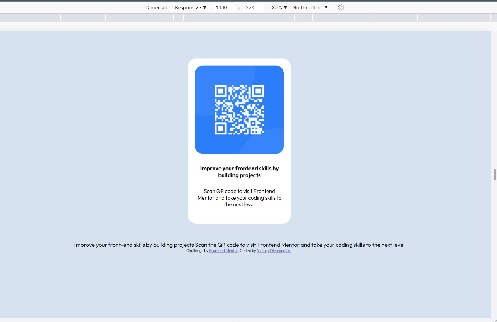

# Frontend Mentor - QR code component solution

This is a solution to the [QR code component challenge on Frontend Mentor](https://www.frontendmentor.io/challenges/qr-code-component-iux_sIO_H). Frontend Mentor challenges help you improve your coding skills by building realistic projects. 

## Table of contents

- [Overview](#overview)
  - [Screenshot](#screenshot)
  - [Links](#links)
  - [Built with](#built-with)
  - [What I learned](#what-i-learned)
  - [Continued development](#continued-development)
- [Author](#author)
- [Acknowledgments](#acknowledgments)

**Note: Delete this note and update the table of contents based on what sections you keep.**

## Overview
this project is really nice building alone comes so much excitement

### Screenshot




**Note: Delete this note and the paragraphs above when you add your screenshot. If you prefer not to add a screenshot, feel free to remove this entire section.**

### Links

- Solution URL: [Add solution URL here](https://github.com/Victoryruro/frontend-mentor-.git)
- Live Site URL: [Add live site URL here](https://victoryruro.github.io/frontend-mentor-/)


### Built with

- Semantic HTML5 markup
- CSS custom properties
- Flexbox


**Note: These are just examples. Delete this note and replace the list above with your own choices**

### What I learned

I learnt the importance of inherit

To see how you can add code snippets, see below:

```html
<main>Some HTML code I'm proud of</main>
```
```css
img {
  width:inherit;
}
```
```js
const proudOfThisFunc = () => {
  console.log('🎉')
}
```

If you want more help with writing markdown, we'd recommend checking out [The Markdown Guide](https://www.markdownguide.org/) to learn more.

**Note: Delete this note and the content within this section and replace with your own learnings.**

### Continued development


I want to develop more on HTML

**Note: Delete this note and the content within this section and replace with your own plans for continued development.**


## Author

- Website - [Victory Diemuodeke](https://www.your-site.com)
- Frontend Mentor - [](https://www.frontendmentor.io/profile/yourusername)
- Twitter - [@vicruro](https://www.twitter.com/vicruro)

**Note: Delete this note and add/remove/edit lines above based on what links you'd like to share.**

## Acknowledgments

 I appreciate God almighty

**Note: Delete this note and edit this section's content as necessary. If you completed this challenge by yourself, feel free to delete this section entirely.**
